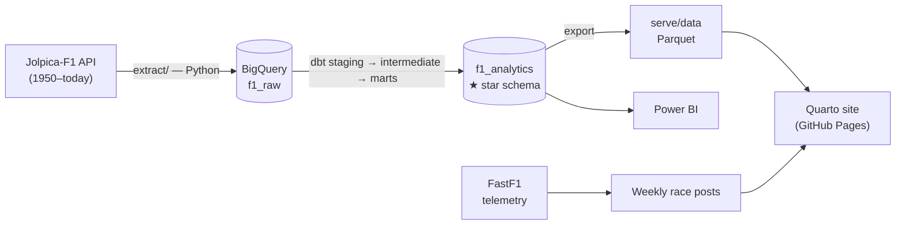

# F1 Analytics — End-to-End ELT

A single repository that takes Formula 1 from **raw API → warehouse → tested
dimensional model → BI**, and doubles as a weekly race-analysis portfolio.

**Stack:** Python · Jolpica-F1 API · BigQuery · **dbt** · Quarto · Power BI · FastF1



This proves the analytics-engineering stack end to end — extract/load, dimensional
modeling, data quality, documentation, and BI — instead of scattering each piece
across separate repos.

## Repository layout

```
extract/        E + L: rate-limited, cached Jolpica client → BigQuery f1_raw
  jolpica/      API client + one extractor per endpoint
  load_bigquery.py, pipeline.py   (python -m extract.pipeline …)
transform/      dbt project — the heart
  models/staging/        11 typed, surrogate-keyed views (stg_jolpica__*)
  models/intermediate/   int_results_enriched (key resolution + flags)
  models/marts/core/     dim_driver|constructor|circuit|race|season|status
  models/marts/results/  fct_race_results|qualifying|pit_stops|*_standings
  models/marts/reporting/ mart_driver_career|constructor_career|season_summary
  tests/  seeds/  macros/  exposures.yml
serve/
  quarto/       data-model + all-time-leaders pages (read the marts)
  powerbi/      BigQuery connection guide + DAX measures
  data/         marts exported to Parquet (committed for the site build)
analysis/2026/  Weekly FastF1 race notebooks (the original portfolio)
utils/  template/  posts/   helpers, notebook templates, blog write-ups
```

## The pipeline

### 1 · Extract + Load (Python → BigQuery)

A polite, cached client pulls the full championship record from
[Jolpica-F1](https://github.com/jolpica/jolpica-f1) (the Ergast successor) and
lands one raw table per endpoint in BigQuery.

```bash
python -m extract.pipeline backfill --seasons 1950:2026   # full history
python -m extract.pipeline refresh  --season 2026         # weekly top-up
```

- Throttled under the 4 req/sec limit; every page is cached to disk, so re-runs
  (or an interrupted backfill) replay instantly.
- ~1,100 races, ~26k results, ~880 drivers, plus qualifying, pit stops and
  standings.

### 2 · Transform (dbt + BigQuery)

`staging → intermediate → marts`, a Kimball **star schema** with
`fct_race_results` at the center and conformed dimensions
(driver, constructor, circuit, race, season, status).

```bash
cd transform
dbt deps && dbt build      # run + test every model
dbt docs generate && dbt docs serve
```

**Data quality** — `unique`/`not_null` on every key, `relationships` from each
fact to its dimensions, `accepted_values` and value-range checks
(`dbt_expectations`), plus singular tests for business invariants (one champion
per season; the champion holds the most points). Models and columns are fully
documented; the Quarto site and Power BI report are declared as dbt **exposures**.

### 3 · Serve

```bash
python -m extract.pipeline export   # marts → serve/data/*.parquet
quarto preview                      # site, incl. the Data Model + Leaders pages
```

- **Quarto** ([live site](https://victorborba7.github.io/f1-data-analysis)) — a
  Data Model page and an interactive All-Time Leaders page built from the marts.
- **Power BI** — connects to the same star schema (live BigQuery or the Parquet
  export); see [serve/powerbi/CONNECTION.md](serve/powerbi/CONNECTION.md).

### One-shot

```bash
python tasks.py all 1950:2026   # backfill → dbt build → docs → export
```

## Setup

```bash
python -m venv .venv && .venv\Scripts\activate     # Windows
pip install -r requirements.txt -r requirements-elt.txt
cp .env.example .env                                # then fill it in
```

**Prerequisites for the warehouse path:** a GCP project with BigQuery enabled and
a service-account JSON key (roles: *BigQuery Data Editor* + *BigQuery Job User*),
referenced by `GOOGLE_APPLICATION_CREDENTIALS` in `.env`.

## Weekly FastF1 workflow (the original portfolio)

Still here and unchanged — telemetry-rich analysis published every race weekend:

1. Copy `template/` → `analysis/2026/R{n}_{city}/`
2. Set `YEAR`, `GRAND_PRIX`, `SESSION` at the top of the notebook
3. Run all cells — charts auto-saved to `assets/`
4. Use the LinkedIn draft generator in the last cell
5. Polish into a `posts/` write-up; commit & push

| Notebook | Skill demonstrated |
|----------|--------------------|
| `race_weekend` | Core EDA & viz |
| `weekend_overview` | Multi-source joins |
| `corner_time_loss` | Signal processing (delta-time) |
| `advanced_analysis` | Statistical modeling (tyre deg, dominance) |

## CI

- **`.github/workflows/publish.yml`** — renders the Quarto site (from committed
  Parquet + freeze) and deploys to GitHub Pages on push to `main`.
- **`.github/workflows/pipeline.yml`** — `workflow_dispatch` / weekly cron: runs
  extract → `dbt build` → export against BigQuery and commits refreshed marts.
  Needs repo secrets `GCP_PROJECT` and `GCP_SA_KEY`.

## Development workflow

Git Flow branching + Conventional Commits, enforced by a commit-message hook.
After cloning, run `./scripts/setup-git.ps1` (or `sh scripts/setup-git.sh`). See
[CONTRIBUTING.md](CONTRIBUTING.md).

---

Follow the weekly analysis on [LinkedIn](https://www.linkedin.com/in/victor-vasconcellos-borba/).
