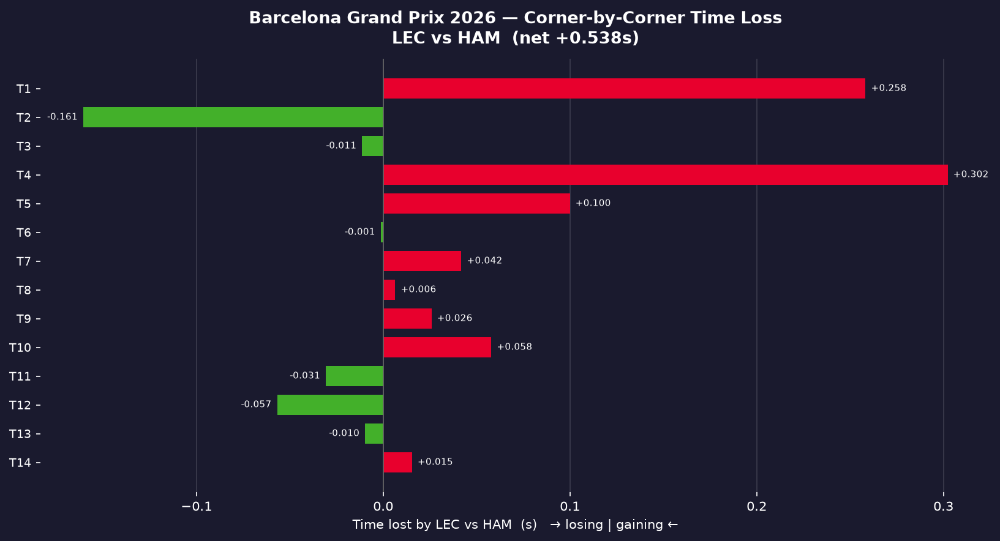
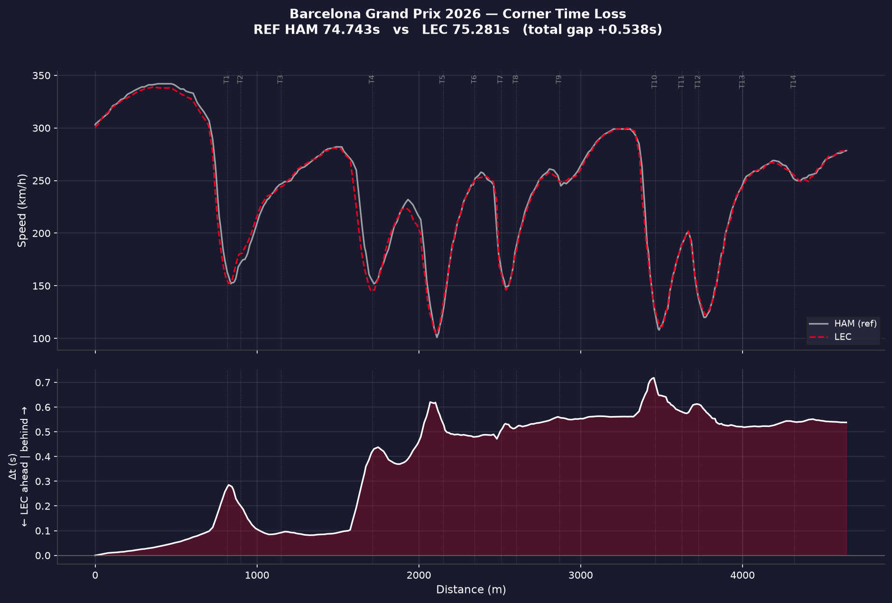
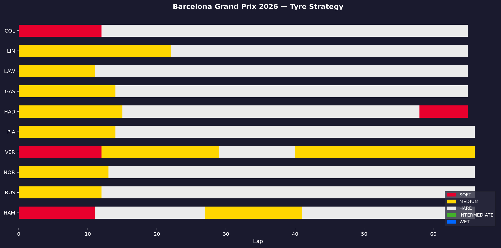

Same car. Same hard tyre. Two world-class drivers. On their fastest laps of the
Barcelona Grand Prix, **Hamilton lapped 0.257s quicker than Leclerc** — so where,
exactly, did that gap open up?

When teammates share the same machinery, the lap-time difference is one of the
cleanest signals we get of *driving* difference. To find it, I aligned both drivers'
fastest laps by track distance and tracked the cumulative time delta around the lap.

## The fastest laps

| Driver | Lap time | Lap | Compound |
|--------|----------|-----|----------|
| Hamilton | 1:20.122 | 44 | Hard |
| Leclerc | 1:20.379 | 47 | Hard |
| **Gap** | **+0.257s** | | |

## Corner by corner

The clearest way to read the gap is to attribute it to each corner — how much time
each driver gained or lost through every part of the lap.

Rather than one big mistake, the gap is the sum of small margins. That's the signature
of a pace difference rather than an error — consistent tenths and hundredths across
several corners instead of one expensive moment.

## The delta trace

Plotting the speed traces above the rolling delta shows *when* the gap grows. Where the
delta line climbs, one driver is pulling time out of the other.

## Strategy context

Both ran the same hard-tyre plan, so the fastest-lap comparison is apples-to-apples —
no tyre-age or compound asterisk on the result.

## Takeaway

With identical equipment, a 0.257s gap built from small margins across multiple corners
points to driving style and confidence rather than car setup or strategy. The next
question — and a good follow-up post — is *which* corner types: low-speed traction zones,
or high-speed commitment?

---

*Built with Python and [FastF1](https://github.com/theOehrly/Fast-F1). The full notebook
behind this analysis is on [GitHub](https://github.com/victorborba7/f1-data-analysis).*
